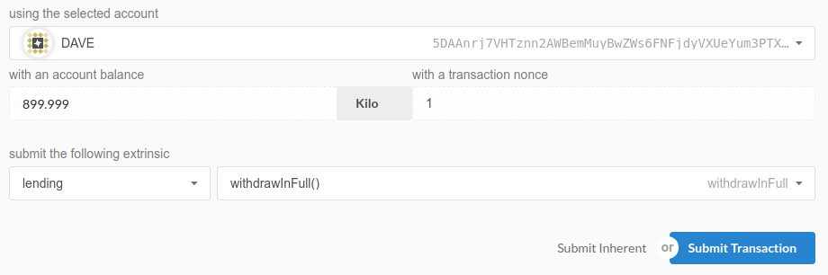

# Substrate Lending Runtime Proof of Concept

Open finance is a concept that strongly resonates with me. Additionally, having the liberty to write code so close to the machinery of a chain is a powerful feature. 

## The Runtime

The runtime logic is simple, and for the sake of brevity, much of it has been generalized. This proof-of-concept was built with speed. It is not production ready. 

In its current state, the runtime is light, only inheriting the balances module and the currency trait. Functionality is limited in the sense that one T::AccountId maps to one loan/deposit. 

## Quickstart 

`$ git clone git@github.com:wilbarnes/substrate-lending-parachain.git`

`$ cd substrate-lending-parachain/`

`$ ./scripts/build.sh`

`$ ./target/release/lending --dev`

With the dev chain now running, navigate to: `https://polkadot.js.org/apps/`

Inside the 'Settings' tab, select 'Local Node (127.0.0.1:9944)' as the endpoint, then Save & Reload. 

### Depositing & Borrowing

- Navigate to the 'Extrinsics' tab. 

- Find 'submit the following extrinsic' and adjust the runtime module to 'lending' and the method to 'deposit(deposit_value)' or 'borrow(borrow_value).'

- Set deposit_value to a value of your choice (note that our demo accounts are only outfit with 1,000,000 units of currency each), though it is suggested you use kilo as the unit of value. 

- Submit Transaction. (See below, bottom right)


The account that submitted the extrinsic will now be accruing interest on a per-block basis. 

### Viewing Compounding Balance

Before we can query the chain state, we need to create our own custom type definition for the struct used to show deposit/borrow terms. This generally only needs to be performed once. 

- Navigate to the 'Settings' tab, and then select the 'Developer' tab within. 

- Manually enter our custom type definition: 

```
{
  "Terms": {
    "deposit": "bool",
    "balance": "Balance",
    "interest_rate": "Perbill",
    "start_block": "BlockNumber",
    "reserved": "Balance"
  }
}
```

- Save.

Now, we can query our state and receive a helpful JSON response in return. Let's begin:

- Navigate to the 'Chain State' tab. 

- Select the 'lending' runtime module. 

- Select 'userBalance(AccountId)' state query with respective AccoundId used to deposit / borrow currency. 

- Submit query using the blue '+' button. (See below, left-hand side)


### Withdrawing / Repaying in Full

Same process as before. 

- Navigate to the 'Extrinsics' tab. 

- Select the 'lending' runtime module. 

- Depending on your previous action, select either the 'withdrawInFull()' or 'repayInFull()' method. 

- Submit transaction. (See below)



### Things to be Consider

- When borrowing currency, it will appear as though your user has not borrowed anything at all (balance appears to be unchanged minus gas fees). However, as a step towards implementing logic that secures collateral, the initial borrow balance of the user is reserved using the ReservableCurrency trait. When the user moves to repay the loan, that initial balance is unreserved and the payment in full, including accrued interest, is transferred from the borrower to the liquidity provider. 

## Overview 

Dispatchable Functions:
```
// supplying currency to the runtime
fn deposit(_origin, deposit_value: T::Balance) -> Result {};
fn withdraw_in_full(_origin) -> Result {};

// borrowing currency from the runtime
fn borrow(_origin, borrow_value: T::Balance) -> Result {};
fn repay_in_full(_origin) -> Result ();

fn on_finalize() {};
```

A user cannot:
- supply currency and then in another transaction supply more
- supply currency and then borrow currency, and vice versa

In each of these scenarios, the extrinsic will fail. The deposit and borrow functions both contain ensure macros that prevent users from performing any action if they have an existing action in the runtime. 

The liquidity provider used is Alice, and this variable is set using the GenesisConfig with the variable being retrieved from the 'src/chain_spec.rs' file. 

- Users supplying currency to Alice compound interest at 1% per block. 
- Users borrowing currency from Alice compound interest at 3% per block. 
- If Alice garners some borrowers she'll be earning good cash. However, her intention is to act as a market maker and she's saved an initial 1,000,000 units of currency to bootstrap her market making operation, so she's looking for folks to supply some additional cash. This is how she'll scale and earn more currency. 

### Supplying and Earning Interest 
- Using the 'deposit()' method, any user can supply currency and start collecting interest from Alice, our liquidity provider. 
- Using the 'withdraw_in_full()' method, any user with a deposit can exit the market collecting their initial stake and any accrued interest. 

### Borrowing and Repaying Interest
- Using the 'borrow()' method, any user can borrow currency and start having the interest they'll eventually pay back start compounding. It's an expensive loan, 25%, so don't borrow and forget!
- Using the 'repay_in_full()' method, any user who's borrowed currency can repay it back in addition to any interest they owe. 

NOTE: Currently, this is an unsecured loan. Let's make the assumption that Alice knows or has vetted the folks she's allowing to borrow from her. 

DEV TODO: Implement logic for secured lending (akin to MakerDAO & Compound).


The runtime constructed here is a Proof-of-Concept, intended solely for instructional purposes at this time, though these are use-cases I will implement over time. 


### Create the lending runtime module
```
substrate-module-new lending wil
```

### We make some initial changes in 'chain_spec.rs'
Our chain specification is found here: 'src/chain_spec.rs' 

To our dev chain, we add three additional accounts (Bob, Charlie, and Dave) that we will outfit with 1_000_000 units of currency. 

# Architecture Decisions 

## Chain Spec

The 'src/chain_spec.rs' file was amended to initialize balances to Alice, Bob, Dave, and Charlie. Each receive an initial balance of 1,000,000 units of currency. This was chosen arbitrarily. Additionally, Alice is set as the initial liquidity provider. 

These Genesis Config values are set using 'config()' when declaring the storage variable in the 'decl_storage!' macro:

`LiquidityProvider get(liquidity_provider) config()`

Note the 'get()' function, this sets the storage variable as a public getter function that can be retrieved from the global chain state. 

## Interest Rate Mechanisms

Working with this was quite difficult. Not much documentation existed beyond the reference docs, so I spent some time iterating and documenting my experience using these types below. 

### Attempting to Implement Permill

`use runtime_primitives::Permill`

I couldn't get some of the associated methods of this trait to return what I needed, and perhaps that was my user error. See compiler error below:

```
Building webassembly binary in runtime/wasm...
   Compiling lending-runtime v1.0.0 (/home/wil/Documents/projects/rust/substrate/lending/runtime)
error[E0599]: no function or associated item named `from_faction` found for type `lending::sr_api_hidden_includes_decl_storage::hidden_include::sr_primitives::Permill` in the current scope
  --> /home/wil/Documents/projects/rust/substrate/lending/runtime/src/lending.rs:67:58
   |
67 |                     let test_permill_fraction = Permill::from_faction(0.25);
   |                                                          ^^^^^^^^^^^^ function or associated item not found in `lending::sr_api_hidden_includes_decl_storage::hidden_include::sr_primitives::Permill`

error[E0599]: no function or associated item named `zero` found for type `lending::sr_api_hidden_includes_decl_storage::hidden_include::sr_primitives::Permill` in the current scope
  --> /home/wil/Documents/projects/rust/substrate/lending/runtime/src/lending.rs:68:54
   |
68 |                     let test_permill_zero = Permill::zero();
   |                                                      ^^^^ function or associated item not found in `lending::sr_api_hidden_includes_decl_storage::hidden_include::sr_primitives::Permill`

error: aborting due to 2 previous errors

For more information about this error, try `rustc --explain E0599`.
error: Could not compile `lending-runtime`.

```
This is a reminder to myself to investigate this further. I discovered that `runtime_primitives::Perbill` offered what I needed, so I went forward with that in the interest of creating a working concept. 

### Compounding Interest

The current process to compound interest occurs in step-by-step fashion, straying away from 'complex' arithmetic. 

My medium-term goal is to implement an Interest Rate Index which allows the accrued interest of an account to be calculated off-chain. Currently, the interest is compounded on a per-block basis using the 'on_finalize()' special function, seen below:

```
fn on_finalize() {
   // existing only for the proof-of-concept
   // in future, this will be replaced with
   // an "Interest Rate Index" that gets updated
   // upon any extrinsic to the runtime
   // Index[a,n] = Index[a,n-1] * (1 + r * t)
                    
   // this is computationally heavy, and 
   // not good practice for blockchains

   // retrieve user count to iterate over
   let user_count = Self::user_count();

   // iterate over open accounts
   for each in 0..user_count {
      // retrieve address
      let addr = Self::user_array(each);
      // compound interest of each account
      Self::compound_interest(addr);
   }
}
```
Performing computations on an array that can expand indefinitely is not good practice. Understanding that, lets work under the assumption that this parachain serves under a light load with Alice operating as the market maker for only a handful of people. The chain will operate just fine under these conditions. 

This is better replaced by an interest rate index that updates only upon a deposit or borrow extrinsic to the runtime that updates the total supply, utilization rate, and subsequently influences a change in the interest rate. 

### Bringing ReservableCurrency into Scope

To emulate the securing of collateral, ReservableCurrency was brought into scope to reserve the initial amount a user has borrowed.

`use support::Reservable Currency`

Within the module logic, when a user borrows currency, the amount borrowed is reserved, as below:

```
fn borrow(_origin, borrow_value: T::Balance) -> Result {
   let sender = ensure_signed(_origin)?;

   // user cannot borrow more, this is a one shot loan
   ensure!(!<UserBalance<T>>::exists(&sender), 
      "User has an existing loan.");

   // high interest rate for borrowers, hard-coded
   let borrow_interest_rate = Perbill::from_percent(3);

   let incr_total_borrow = Self::total_borrow()
      .checked_add(<T::Balance as As<u64>>::as_(borrow_value))
      .ok_or("Overflow encourtered incrementing total borrow")?;

   <balances::Module<T>>::reserve(
      &sender,
      borrow_value,
   )?;
```

As mentioned in the Quickstart, when borrowing currency, the user's initial balance is reserved and not included as part of that user's 'free balance.' 

As per the terminology in the reference docs:

```
Free Balance: The portion of a balance that is not reserved. The free balance is the only balance that matters for most operations. When this balance falls below the existential deposit, most functionality of the account is removed. When both it and the reserved balance are deleted, then the account is said to be dead.
```
The balance you see after borrowing is that user's free balance. The reserved balance still resides within that users account. In the future, reserving or locking currency will be used to secure collateral for users looking to borrow. How this will be implemented has yet to be decided. More research needs to be done. 

# Todo

**TODO**: Implement treasury runtime, allowing a pot to be set that multiple liquidity providers can interact with (allow folks to pool currency).
**TODO**: Implement logic requiring users to secure collateral as a condition for borrowing. Seemingly, this can be done with the Lockable & Reservable Currency traits. 

# Tests

Run tests:

`cargo test -p lending-runtime`
